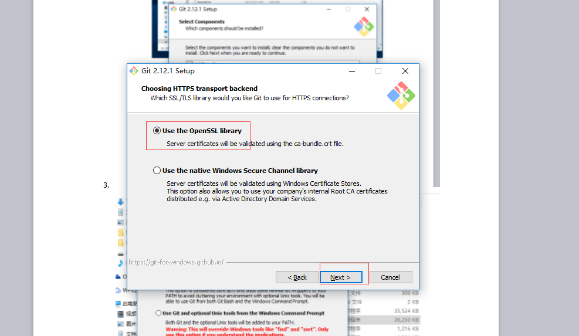
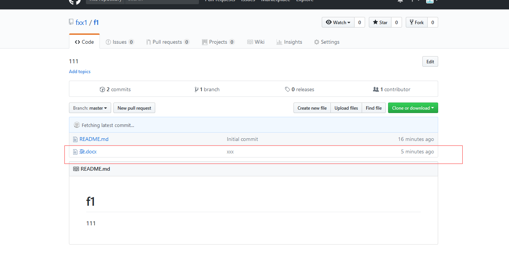

gitbash安装
==
1.双击该文件安装 

2.
3.
4.
5.
6.
7.
8.
9.
10.这样就安装成功了。 
11.如何将本地文件上传到github文件库里. 
12.在本地电脑里找到上传文件的位置点击鼠标右键 

13.
14.
15.
回车 
16.
回车 
17.
回车 
18.
回车 
19.
回车 
20.
回车 
21.
22.这样就成功了，打开githob发现多了一个文件。 

23.如果远程库有更新,那么本地值需要git pull就可以更新. 

24.
25.
26.
本地文件也从只有数字变成了英文字母添加，实现了更新。 
