oracle11g安装
===
1.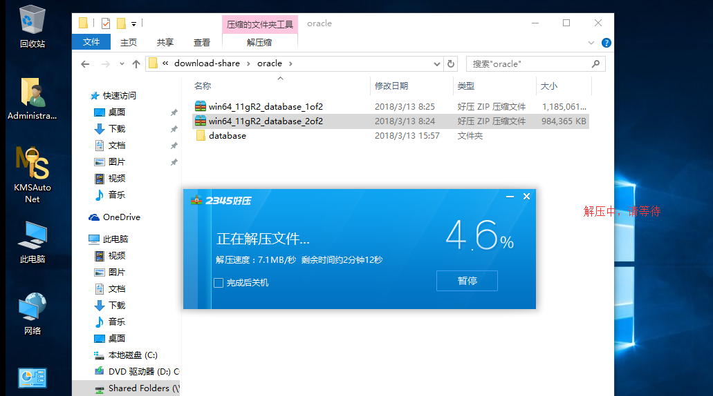 
2. 
3.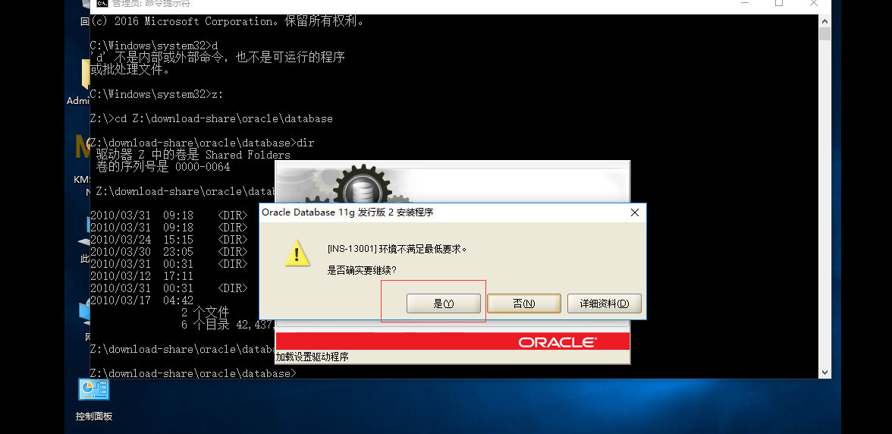 
4.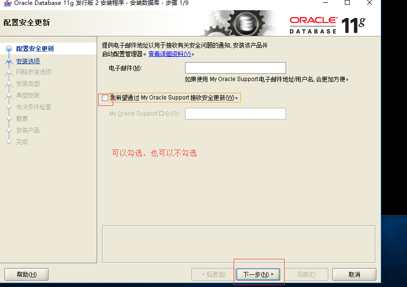 
5.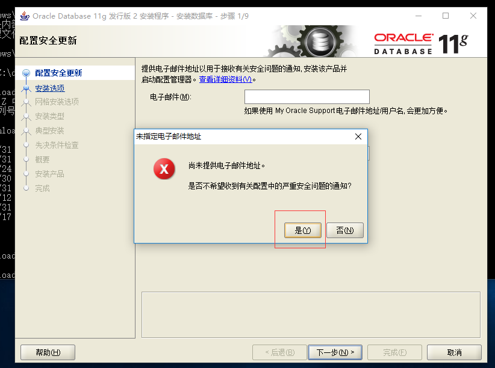 
6.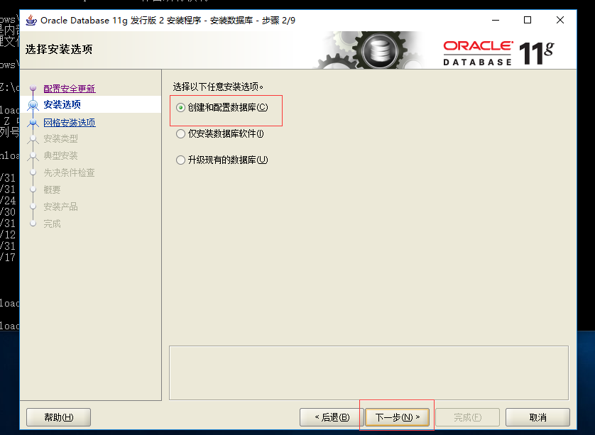 
7.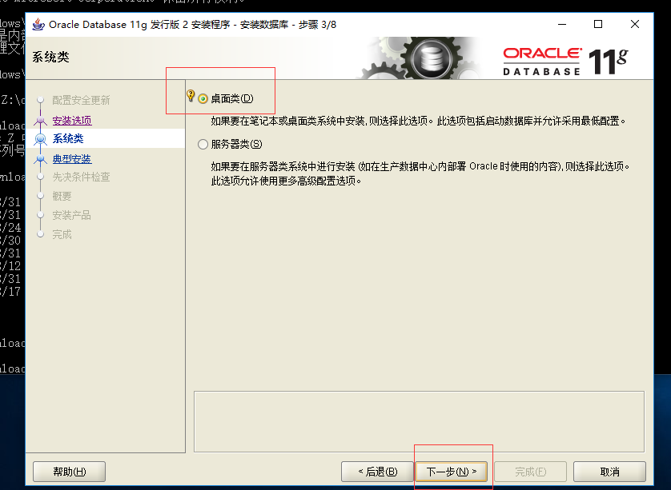 
8.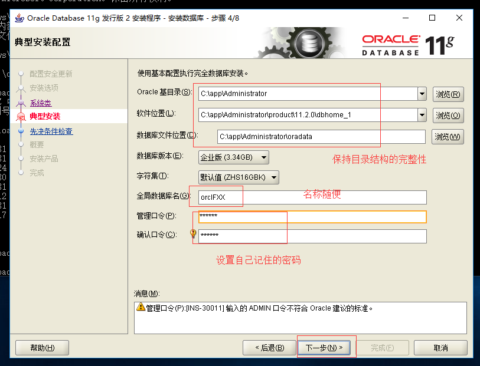 
9.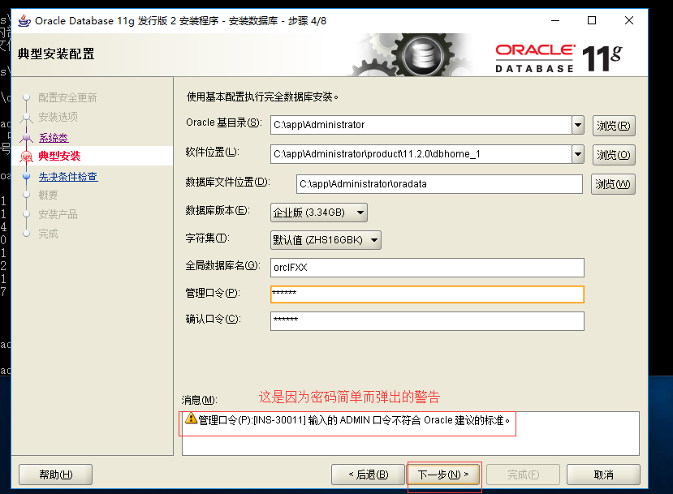 
10.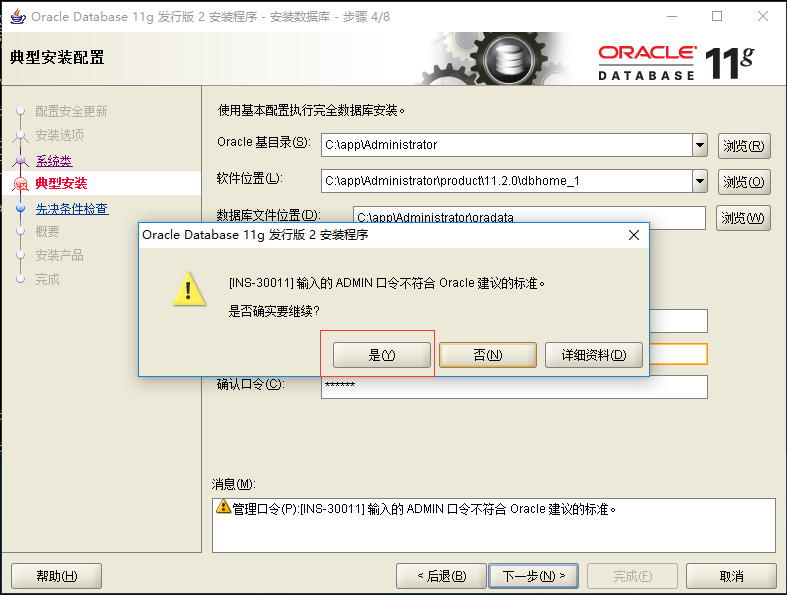 
11.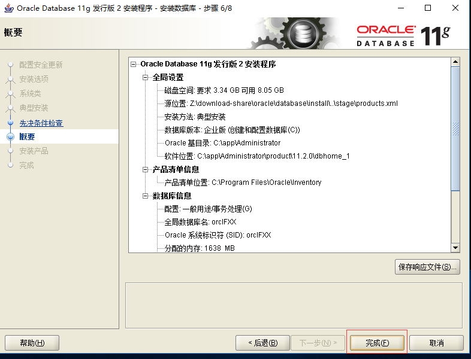 
12. 
13.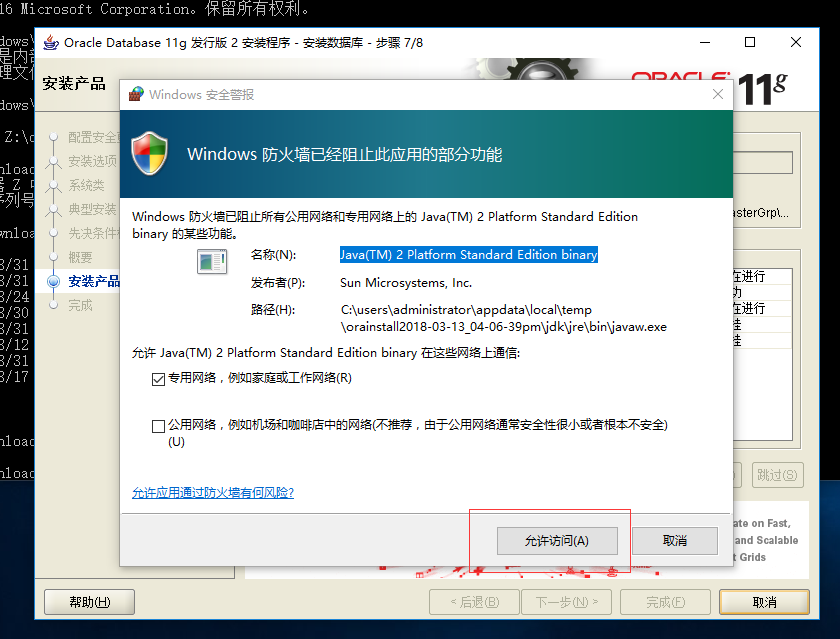 
14.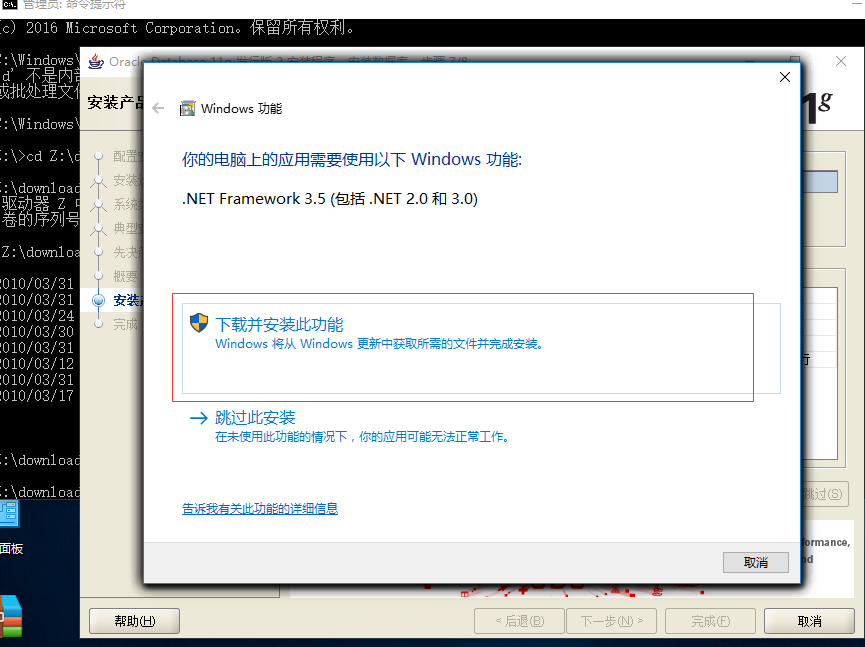 
15.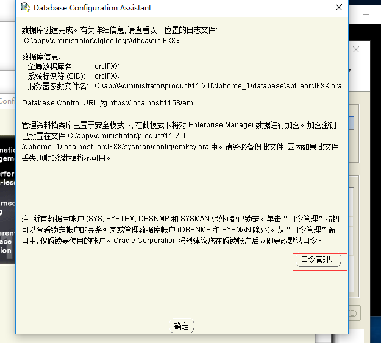 
16. 
17.输入网址：https://localhost:1158/em/ 
使用system+刚才设置的密码登陆验证是以下效果 
18.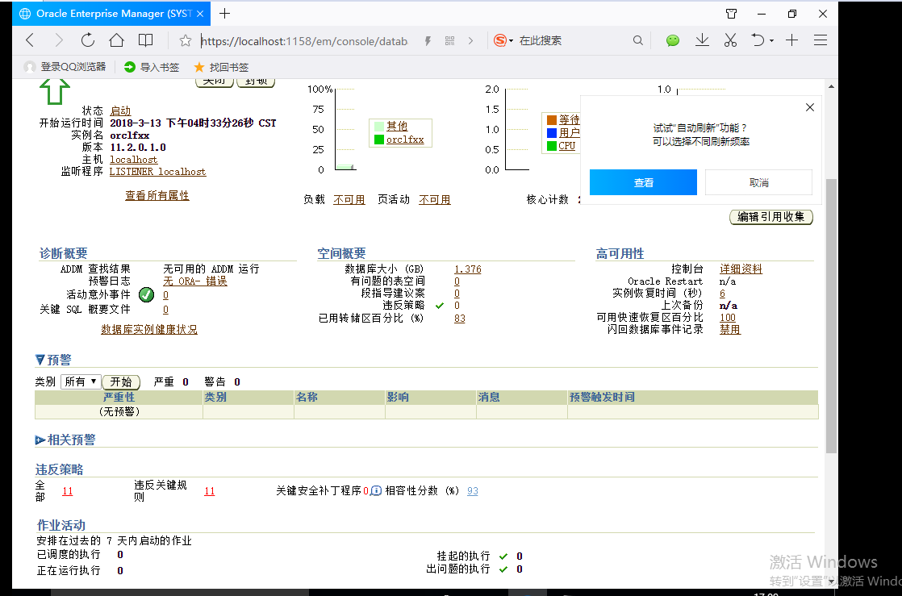 
19.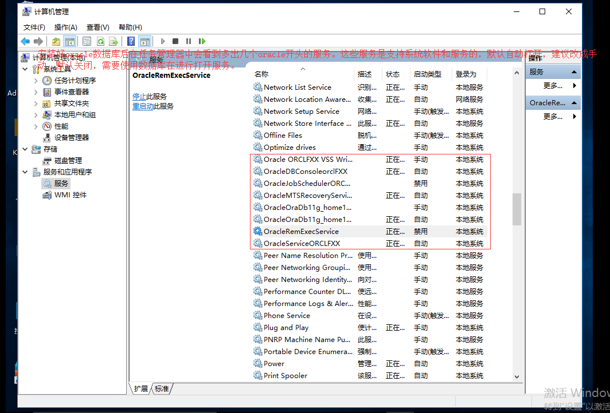 
20.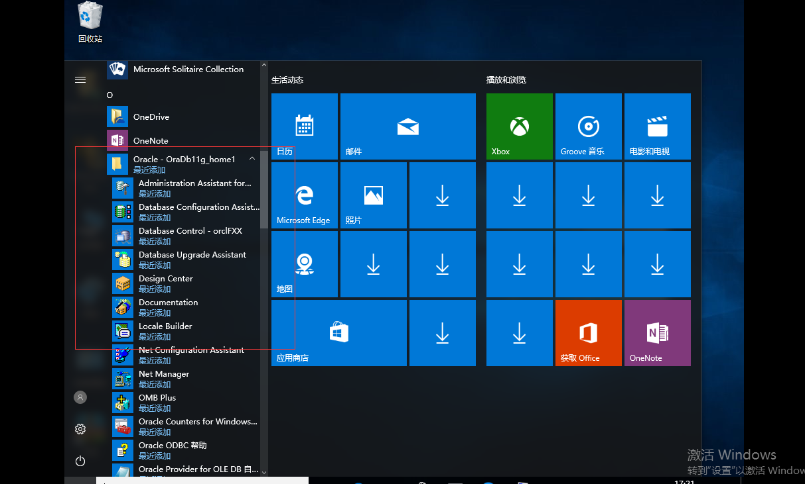 
21.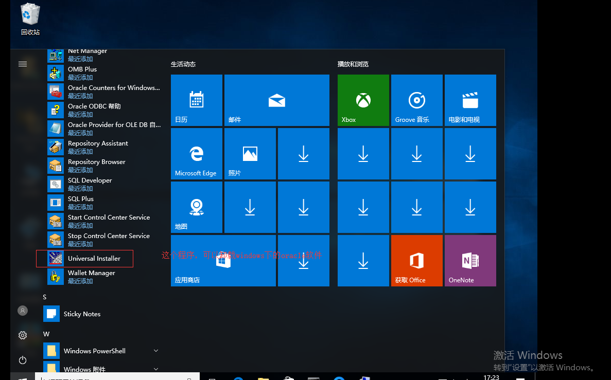 
22.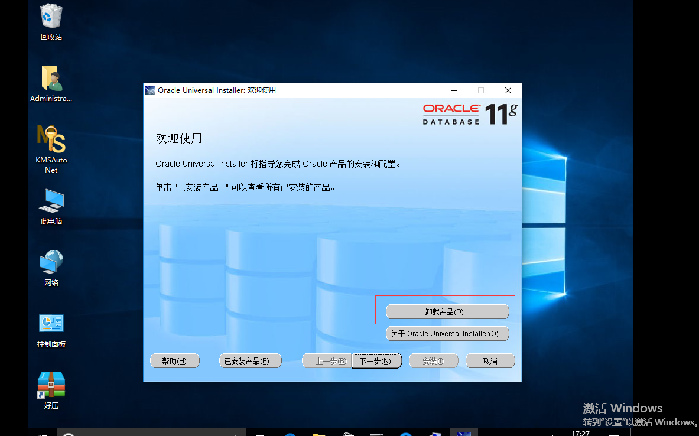 
23.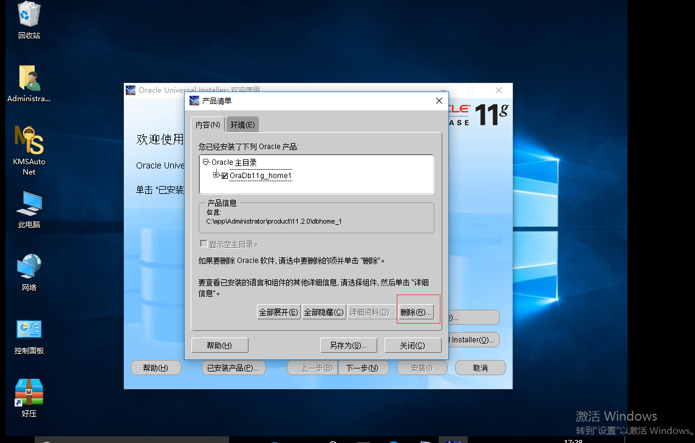 
24. 
25.这样oracle11g安装及卸载就完成了。
