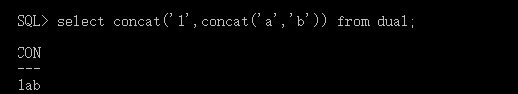
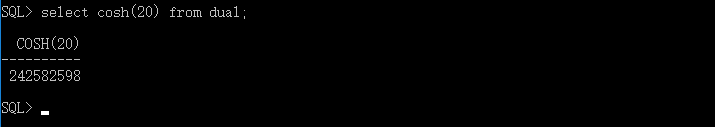
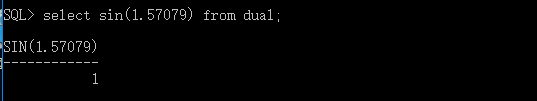
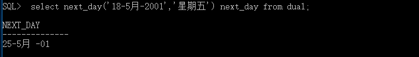
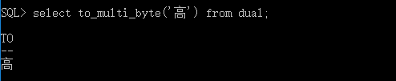

测试函数
=====
1.ASCII 
返回与指定的字符对应的十进制数 
 
2. CHR 
给出整数,返回对应的字符;  
 
3. CONCAT 
连接两个字符串; 
 
4. INITCAP 
返回字符串并将字符串的第一个字母变为大写;  
 
5.INSTR(C1,C2,I,J) 
在一个字符串中搜索指定的字符,返回发现指定的字符的位置;  
C1 被搜索的字符串  
C2 希望搜索的字符串  
I 搜索的开始位置,默认为1  
J 出现的位置,默认为1  
 
6.LENGTH 
返回字符串的长度; 
 
7.LOWER  
返回字符串,并将所有的字符小写 
 
8.UPPER  
返回字符串,并将所有的字符大写 
 
9.RPAD和LPAD(粘贴字符)  
RPAD 在列的右边粘贴字符  
LPAD 在列的左边粘贴字符 
 
10.LTRIM和RTRIM 
LTRIM 删除左边出现的字符串  
RTRIM 删除右边出现的字符串 
 
11.SUBSTR(string,start,count)  
取子字符串,从start开始,取count个  
 
12.REPLACE(string,s1,s2)  
string 希望被替换的字符或变量  
s1 被替换的字符串  
s2 要替换的字符串  
 
13.SOUNDEX  
返回一个与给定的字符串读音相同的字符串 
 
14.4.TRIM(s from string) 
LEADING 剪掉前面的字符  
TRAILING 剪掉后面的字符  
如果不指定,默认为空格符  
15.ABS  
返回指定值的绝对值  
 
16.ACOS  
给出反余弦的值 
 
17.ASIN  
给出反正弦的值  
 
18.ATAN  
返回一个数字的反正切值  
 
19.CEIL  
返回大于或等于给出数字的最小整数 
 
20.COS  
返回一个给定数字的余弦  
 
21.COSH  
返回一个数字反余弦值  
 
22.EXP  
返回一个数字e的n次方根 
 
23.FLOOR  
对给定的数字取整数 
 
24.LN  
返回一个数字的对数值 
 
25.LOG(n1,n2)  
返回一个以n1为底n2的对数 
 
26.MOD(n1,n2)   
返回一个n1除以n2的余数 
 
27.POWER  
返回n1的n2次方根  
 
28.ROUND和TRUNC   
按照指定的精度进行舍入   
 
29.SIGN  
取数字n的符号,大于0返回1,小于0返回-1,等于0返回0 
 
30.SIN  
返回一个数字的正弦值 
 
31.SIGH  
返回双曲正弦的值 
 
32.SQRT  
返回数字n的根 
 
33.TAN  
返回数字的正切值  
 
34.TANH  
返回数字n的双曲正切值  
 
35.TRUNC  
按照指定的精度截取一个数 
 
36.ADD_MONTHS  
增加或减去月份 
 
37.LAST_DAY  
返回日期的最后一天
 
38.MONTHS_BETWEEN(date2,date1)  
给出date2-date1的月份  
 
39.NEW_TIME(date,this,that)  
给出在this时区=other时区的日期和时间  
 
40.NEXT_DAY(date,day)  
给出日期date和星期x之后计算下一个星期的日期  
 
41.SYSDATE  
用来得到系统的当前日期 
 
trunc(date,fmt) 
按照给出的要求将日期截断,如果fmt=mi表示保留分,截断秒  
 
42.CHARTOROWID  
将字符数据类型转换为ROWID类型  
43.CONVERT(c,dset,sset)  
将源字符串 sset从一个语言字符集转换到另一个目的dset字符集  
 
44.HEXTORAW  
将一个十六进制构成的字符串转换为二进制  
45.RAWTOHEXT  
将一个二进制构成的字符串转换为十六进制  
46.ROWIDTOCHAR  
将ROWID数据类型转换为字符类型 
47.TO_CHAR(date,format)  
将oracle里面的一个日期转换成字符串. 
 
48.TO_DATE(string,format) 
将字符串转化为ORACLE中的一个日期 
49.TO_MULTI_BYTE  
将字符串中的单字节字符转化为多字节字符  
 
50.TO_NUMBER  
将给出的字符转换为数字  
 
51.BFILENAME(dir,file)  
指定一个外部二进制文件  

