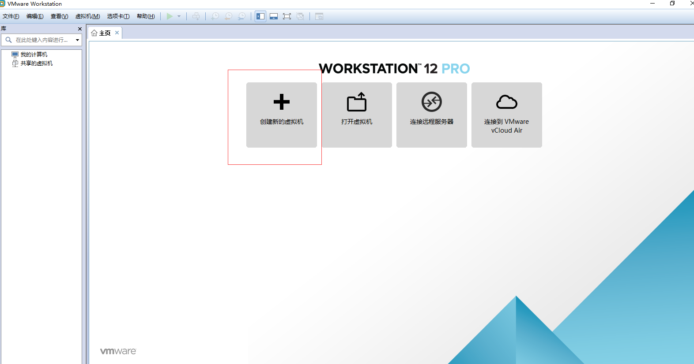

vm安装
===
1. 
2. 
3. 
4. 
5. 
6. 
7. 
8. 
9. 
10. 
11. 
12. 
13. 
14. 
15. 
16. 
17. 
18. 
19. 
20. 
21. 
22. 
23. 
24. 
25. 
26. 
27. 
28. 
29. 
30. 
31. 
32. 
33. 
34. 
35. 
36. 
37. 
38. 
39. 
40. 
41. 
42. 
43. 
44. 
45. 
46. 
47. 
48. 
49. 
50. 
51. 
52. 
53. 
54. 
55. 
56. 
57. 
58. 
59. 
60. 
61. 
62. 
63. 
64. 
65. 
66. 
67. 
68. 
69. 
70. 
71. 
72. 
73. 
74. 
75. 
76. 
77. 
78. 
79. 
80. 
81. 
82. 
83. 
84. 
85. 
86. 
87. 
88. 
89. 
90. 
91. 
92. 
93. 
94.这样win10虚拟机就安装成功了。

