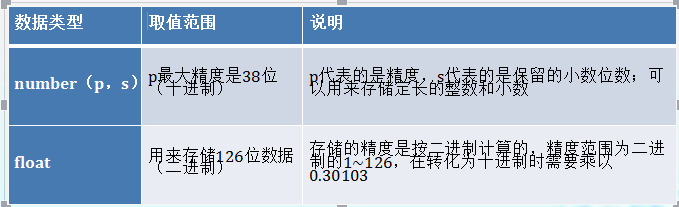
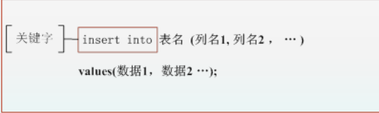

一.Oracle中常用的数据类型
====
在Oracle 11g中提供的数据类型有23种。根据表示的数据可以分为4大类：字符型、数字型、日期类型和其它数据类型。下面依次讲解这4大类。 
1.字符型 
字符型在Oracle 11g中有varchar2、char、nchar、nvarchar2和long五种。 
 
2.数字型 
数字型在Oracle 11g中常用的有number和float两种，可以用它们来表示整数和小数。 
 
3.日期类型 
日期类型在Oracle 11g中常用的有date和timestamp两种类型，可以用它们来存放日期和时间。 
 
4.其它数据类型 
除了以上讲的数据类型外，在Oracle 11g中还有存放大数据的数据类型以及存放二进制文件的数据类型。 
 
二.创建Oracle数据表
===
1.利用命令创建数据表 
 
2.修改数据表结构 
对于已经建立的表进行修改的情况包括以下几种。 
添加或删除表中的列，或者修改表中的列的定义。 
对表进行重新命名。 
将表移动到其他表空间。 
添加、修改或删除表中的约束条件。 
启用或禁用表中的约束条件、触发器等。 
Oracle提供了SQL语句DESC实现数据表结构查询，ALTER TABLE进行修改，其语法如图所示。
 
(1)增加列：如果需要在一个表中保存实体的新属性，需要在表中增加新的列，在一个表中增加一个新列的语法格式如下所示。 
 
(2)更改列：如果需要调整一个表中某些列的数据类型、长度和默认值，就需要更改这些列的属性。没有更改的列则不会受任何影响，更改表中现有列的语法格式如下所示。 
 
(3)删除列：当不需要某些列时，可以将其删除，直接删除列的语法如下所示。 
 
三.删除数据表
===
Oracle提供了SQL语句drop table实现数据表的删除，其语法如图所示。
 
四.对数据表中数据的操作
===
对于数据表中数据的操作无非就是对数据进行添加、修改、删除等操作。本节将用SQL语句来对表中数据添加、修改、删除操作依次进行举例说明。 
1.添加数据 
Oracle提供了SQL语句insert into实现数据的添加，其语法如图所示。 
 
2.查看数据 
查看数据表中建好的数据用select语句. 
例如:select * from 表名  
3.修改数据 
修改数据也是经常使用的，在已经存在数据的表中修改数据使用update语句即可完成。语法如图所示。 
 
五.特殊的数据表dual 
Oracle中包括非常特殊的数据表——dual。dual表实际属于系统用户sys，具有了数据库基本权限的用户，均可查询该表的内容。通过关键字desc，可以查看该数据表的结构。 

六.数据查询 
在SQL语句中，数据查询语句select是使用频率最高、用途最广泛的语句。它由许多子句组成。通过这些子句可以完成选择、投影和连接等各种运算功能，得到用户所需的最终数据结果。本章将主要介绍基本查询、子查询、联合语句、单表关联语句及多表查询的相关使用。 
1.基本查询 
select语句可以根据用户的要求查询数据库中的数据，并且可以对它们进行简单的计算和统计。最简单的select语句只有一个from子句，语法格式如图所示。 
 
2.为列设置别名 
默认情况下，在显示数据时，各列的标题就是列的名称。在select语句中可以定义列的别名。这样在显示数据时，列的标题就是这个别名。在整个SQL语句中都可以使用这个别名。使用别名的select语句格式如图所示。 
 
3.利用distinct获得唯一性记录 
 
4.where子句 
where子句指定的条件是一个关系表达式。如果关系表达式的结果为真，则条件成立，否则条件不成立。关系表达式用于比较两个表达式的大小，或者进行模糊匹配，或者将一个表达式的值与一个集合中的元素进行匹配。下表列出了常用的关系运算符。 
 
where子句语法如图所示。 
 
5.在查询中使用比较表达式 
比较表达式可以使常量、变量和列表达式的任意组合，在where子句中可以使用的比较运算符包括：=、!=、>、>=、<、<=。表达式的使用比较简单。 
6.使用简单逻辑表达式 
在where子句中，可以使用逻辑运算符（and、or、not）将多个单独的搜索条件结合在一起，形成一个复合的搜索条件。当对复合的搜索条件求职时，数据库管理系统会对每个单独的搜索条件求值，然后执行布尔运算来决定整个where子句的值是true或者false。 
7.使用简单逻辑表达式
and与,or或,not非. 
8.指定数据范围 
8.1使用between查询 
between…and…用在where子句中查询两个条件之间的记录。其常用形式如表所示。 
 
8.2使用in查询 
同between关键字一样，in的引入也是为了更方便地限制检索数据的范围，限制条件在in运算符后面罗列，并以()包括起来，条件用逗号分开。当要判断的表达式处于括号中列出的一系列值之中时，in运算符求值为真。 
9.like进行模糊查询 
有时候我们并不记得要查询的具体人名，比如我们只记得某员工首字母S。这时我们可以进行模糊查询。语法如图所示 
 
注意：0到多个字符用“%”表示，单个字符用“_”表示，具体如表所示。 
 
 
10.order by子句 
select语句可以使用的最后一个子句是order by子句。以前在查询数据时，数据显示的顺序是不可预知的。如果需要对检索到的结果集进行排序此时，就要借助于order by子句。语法如图所示。
 
11.group by子句 
有时候要对查询结果的数据进行分组统计，在Oracle中提供了group by 子句来实现其功能，不过我们在学习group by子句之前应该先了解一下分组函数。因为group by语句常和分组函数一起使用，常用的分组统计函数如表所示。 
 
12.having子句 
having子句通常和group by 子句一起使用，用来限制搜索条件。和having子句与组有关，不与单个值有关，它会作用于group by创建的组。其语法如图所示。 
 

